- [虚拟网络配置实验](#虚拟网络配置实验)
  - [实验环境：](#实验环境)
  - [实验要求](#实验要求)
  - [组建网络](#组建网络)
    - [理了一下，画了一个完整的带virtualbox虚拟网络逻辑的网络拓扑图](#理了一下画了一个完整的带virtualbox虚拟网络逻辑的网络拓扑图)
  - [安装虚拟机](#安装虚拟机)
  - [配置网络连接](#配置网络连接)
  - [连通性测试](#连通性测试)
    - [靶机可以直接访问攻击者主机](#靶机可以直接访问攻击者主机)
    - [攻击者主机无法直接访问靶机](#攻击者主机无法直接访问靶机)
    - [网关可以直接访问攻击者主机和靶机](#网关可以直接访问攻击者主机和靶机)
    - [所有节点均可访问互联网&靶机的所有对外上下行流量必须经过网关](#所有节点均可访问互联网靶机的所有对外上下行流量必须经过网关)
      - [intnet1测试：](#intnet1测试)
      - [intnet2 测试:](#intnet2-测试)
      - [attacker 互联网测试：](#attacker-互联网测试)
  - [遇到的问题：](#遇到的问题)
  - [参考链接](#参考链接)
  - [根据个人理解写的课件上的思考题：](#根据个人理解写的课件上的思考题)
    - [以下⾏为分别破坏了CIA和AAA中哪⼀个属性或多个属性？](#以下为分别破坏了cia和aaa中哪个属性或多个属性)
    - [有⼀次，小明⼝袋里有100元，因为打瞌睡，被小偷偷⾛了，搞得晚上没饭吃。又⼀天，小明⼝袋里有200元，这次小明为了防范小偷，不打瞌睡了，但却被强盗持⼑威胁抢⾛了，搞得⼀天没饭吃，小明当天就报警了。](#有次小明袋里有100元因为打瞌睡被小偷偷了搞得晚上没饭吃又天小明袋里有200元这次小明为了防范小偷不打瞌睡了但却被强盗持威胁抢了搞得天没饭吃小明当天就报警了)
    - [针对下述论点，分别设计⼀场景案例（必须和课程相关），使得该论点在该场景中成立](#针对下述论点分别设计场景案例必须和课程相关使得该论点在该场景中成立)
    - [试分析“CAPTCHA图片验证码技术可以阻⽌恶意批量注册⾏为”这句话中的安全策略、安全机制和安全假设分别是什么？CAPTCHA图片举例](#试分析captcha图片验证码技术可以阻恶意批量注册为这句话中的安全策略安全机制和安全假设分别是什么captcha图片举例)
    - [某⼤型软件开发公司的总裁担⼼公司的专利软件设计⽅法被内部员⼯泄露给其他公司，他打算防⽌泄密事件的发⽣。于是他设计了这样⼀个安全机制： 所有员⼯必须每天向他汇报自⼰和其他竞争对⼿公司员⼯的所有联系(包括IM、电⼦邮件、电话等等) 。你认为该安全机制能达到总裁的预期安全效果吗？为什么？](#某型软件开发公司的总裁担公司的专利软件设计法被内部员泄露给其他公司他打算防泄密事件的发于是他设计了这样个安全机制-所有员必须每天向他汇报自和其他竞争对公司员的所有联系包括im电邮件电话等等-你认为该安全机制能达到总裁的预期安全效果吗为什么)
    - [请列举你经常使用的互联⽹服务有哪些，通过公开渠道检索这些服务提供商在历史上是否经历过安全事件？据此，撰写⼀篇主题为：《某某互联⽹服务安全问题概要》的调研报告。](#请列举你经常使用的互联服务有哪些通过公开渠道检索这些服务提供商在历史上是否经历过安全事件据此撰写篇主题为某某互联服务安全问题概要的调研报告)
# 虚拟网络配置实验
## 实验环境：
* VirtualBox 6.1.26 ; ubuntu 20.04
* 攻击者主机： kali 2021.2
* 网关：Debian 10
* 靶机：
    * kali 2021.2
    * Debian 10
    * Windows XP Professional with Service Pack 3 (x86) 

## 实验要求
- [x] 靶机可以直接访问攻击者主机
- [x] 攻击者主机无法直接访问靶机
- [x] 网关可以直接访问攻击者主机和靶机
- [x] 靶机的所有对外上下行流量必须经过网关
- [x] 所有节点均可以访问互联网
## 组建网络

### 理了一下，画了一个完整的带virtualbox虚拟网络逻辑的网络拓扑图
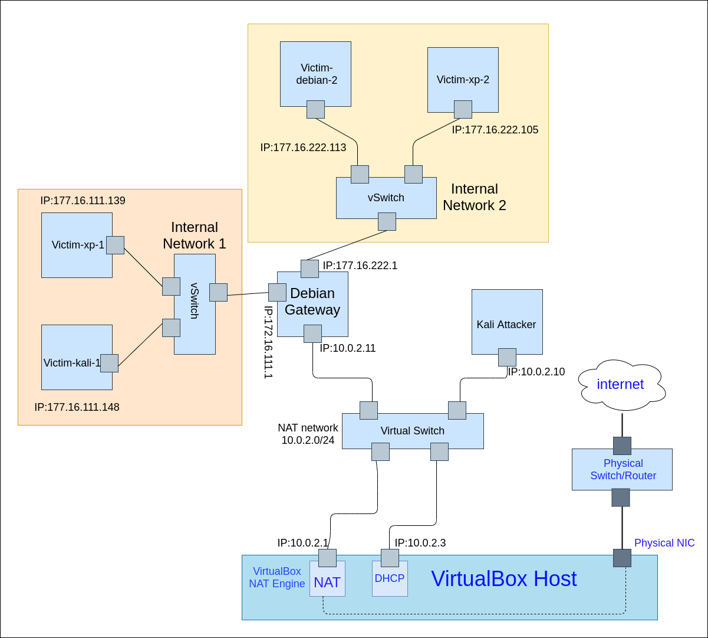

其中Gateway 经过适当配置，就可以模拟老师所给的网络环境了：

##  安装虚拟机
* Kali 直接导入官方的ova文件。
* debian,xp,直接导入老师给的ovf文件, 基本开箱即用,xp关一下防火墙。
然后配置多重加载镜像。在做的时候，由于用的是老师给的ovf文件,发现网关的网络配置已经全被配好了。剩下的就相当于如何连接网线的问题。

## 配置网络连接
按照上述拓扑图,需要6台虚拟机。
Network 按照下图顺序配置：
* **Debian gateway 设置：**
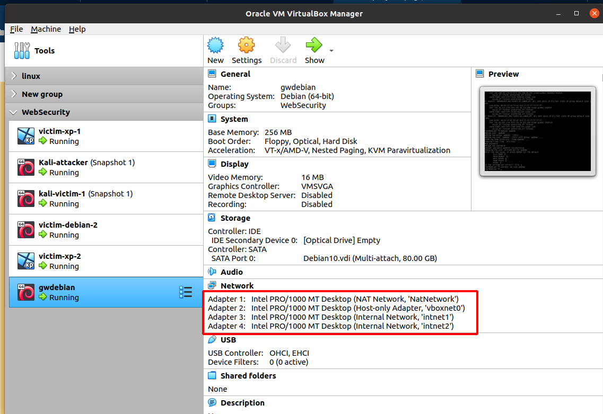
开机后的ip:
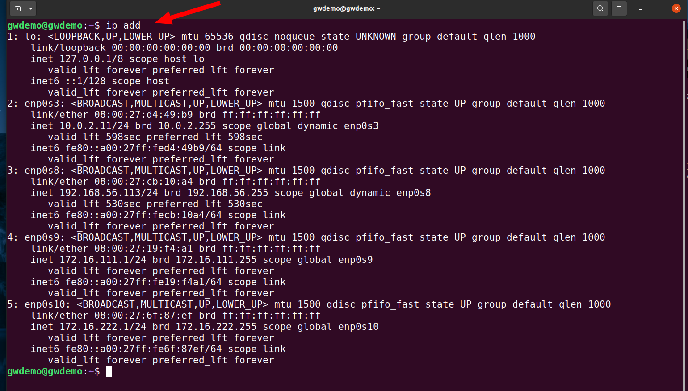

然后自己建立一个账户,用ssh,登陆到网关上。

* **kali-attacker 设置：**
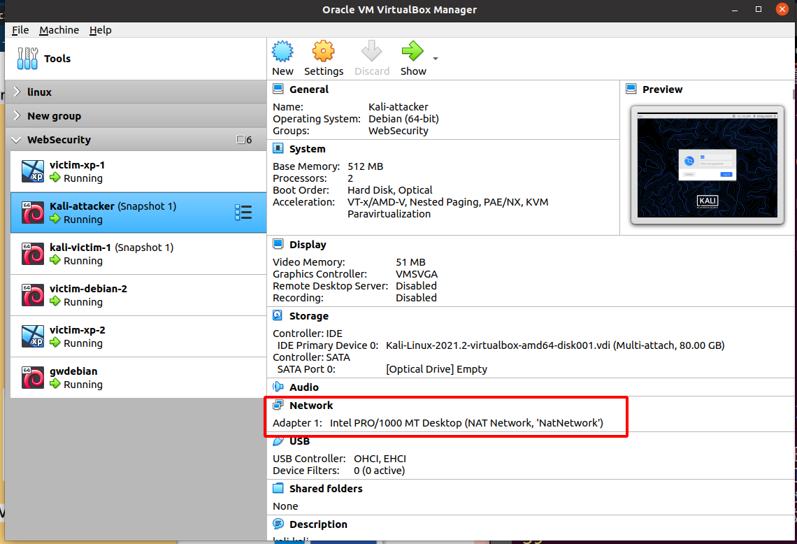

**所有的网络设置见下面表格：**

| 靶机名称        | 网络设置                          | ip 地址        |
|-----------------|-----------------------------------|----------------|
| kali-victim-1   | intnet1                           | 172.16.111.148 |
| victim-xp-1     | intnet1(网卡选择 PCnet-FAST III ) | 172.16.111.139 |
| victim-Debian-2 | intnet2                           | 172.16.222.113 |
| victim-xp-2     | intnet2(网卡选择 PCnet-FAST III ) | 172.16.222.105 |

## 连通性测试 

### 靶机可以直接访问攻击者主机
* **攻击者主机ip地址：**
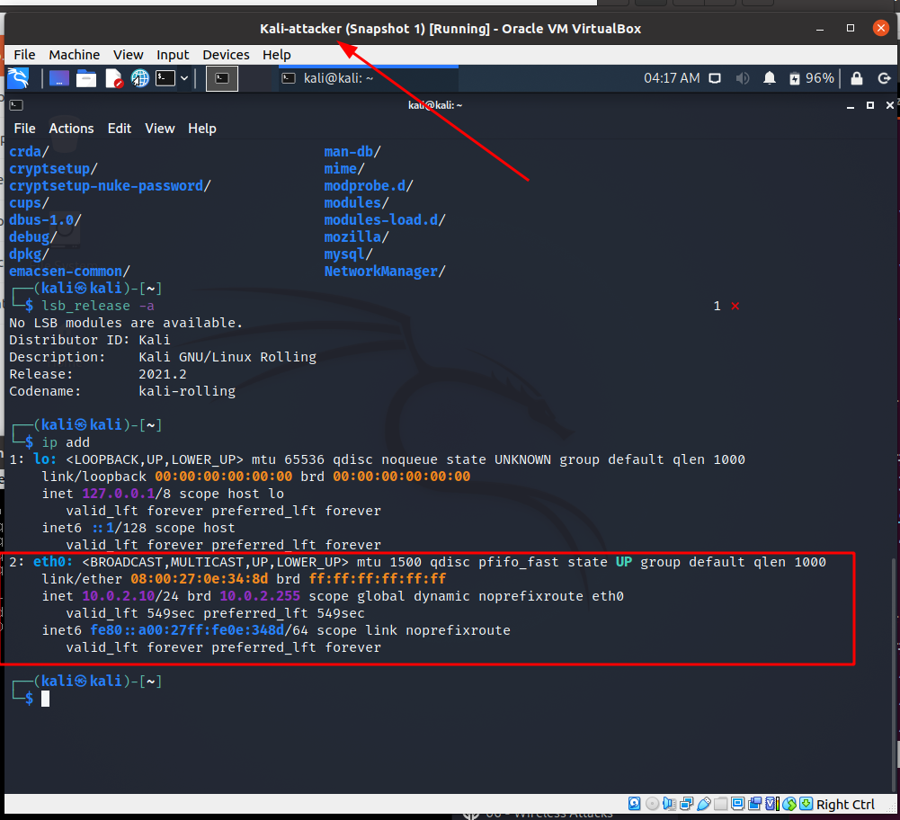
* **4台靶机ping攻击者主机ip：**
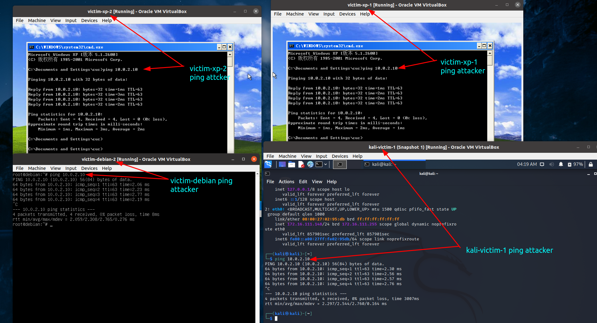

虚拟机名字最后的数字表示其在内部网络1或2上

### 攻击者主机无法直接访问靶机
* **攻击者主机ping  Intnet1 上的靶机：**
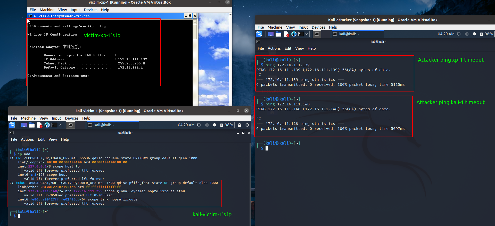

攻击者主机访问在内部网络1中靶机的超时

* **攻击者主机ping Intnet2 上的靶机：**
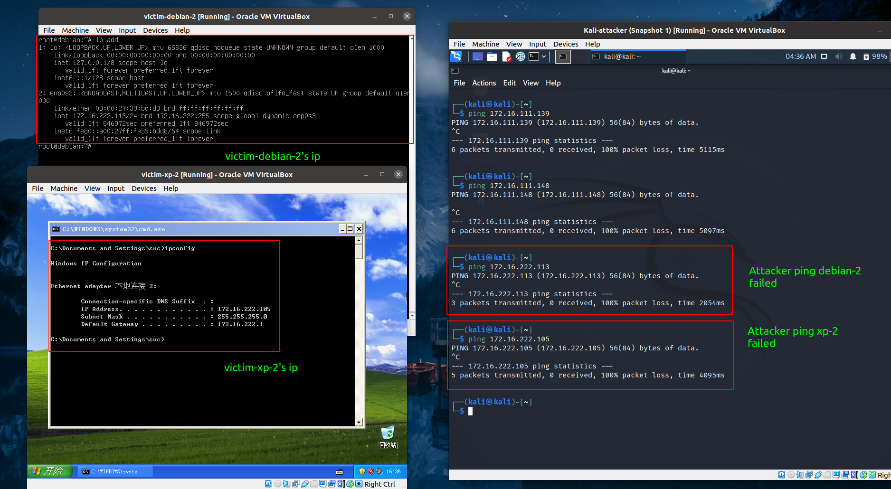

攻击者不能访问在内部网络2中的靶机

### 网关可以直接访问攻击者主机和靶机
* **网关直接访问内部网络1靶机与攻击者主机：**
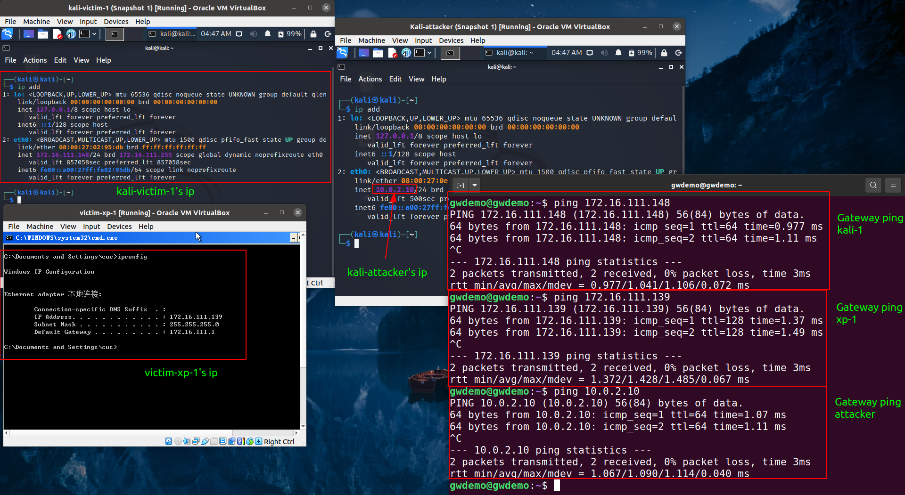

网关能访问内部网络1与攻击者主机

* **网关直接访问内部网络2靶机：**

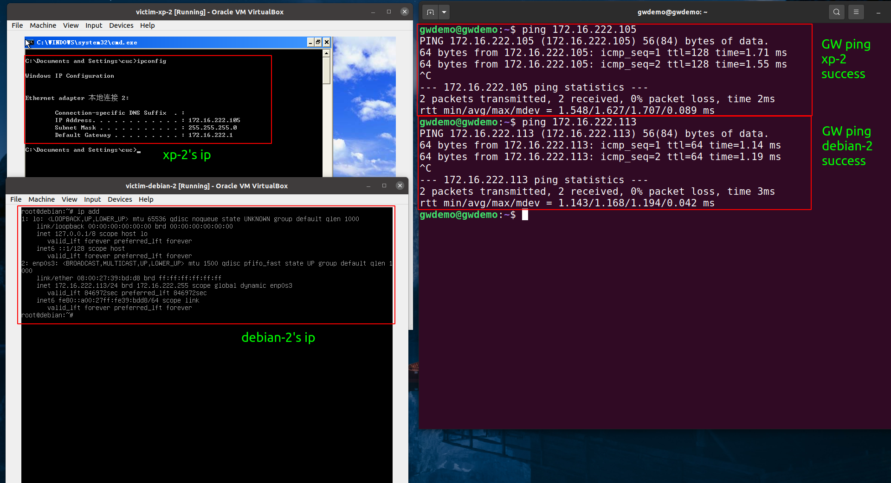

网关能访问内部网络2上的主机

### 所有节点均可访问互联网&靶机的所有对外上下行流量必须经过网关

* **网关安装tcpdump,近源抓包**

#### intnet1测试：
intnet1 连接在网关enp0s9 网络接口上,`tcpdump -i enp0s9 -n -W net1.pcap`
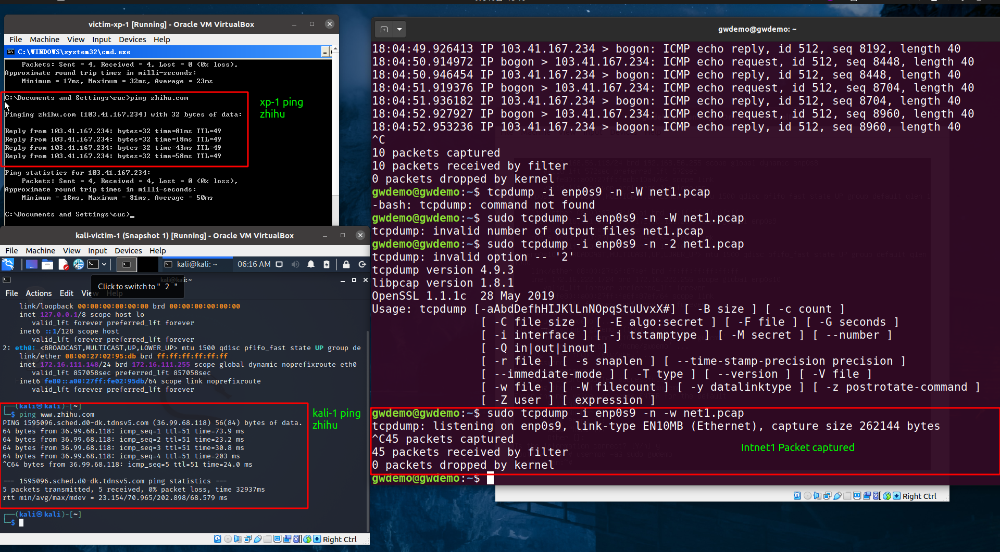

内部网络1上ping zhihu

然后将抓到的包scp拷贝到自己的电脑上。

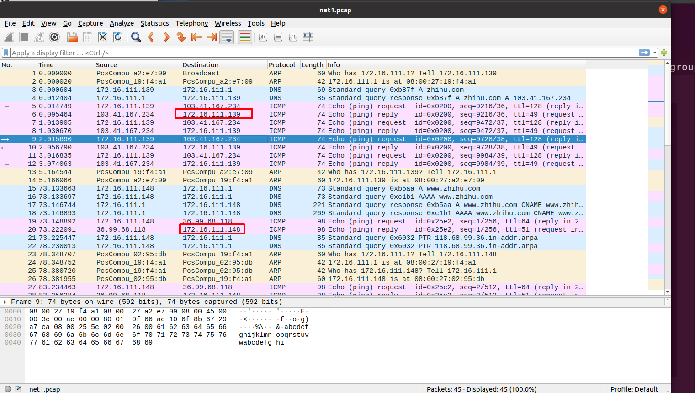

网关在内部网络1上抓到的包

可以表明，局域网intnet1的流量是经过网关的。

#### intnet2 测试:
intnet2 连接在网关enp0s10 网络接口上,跟上面同样步骤.
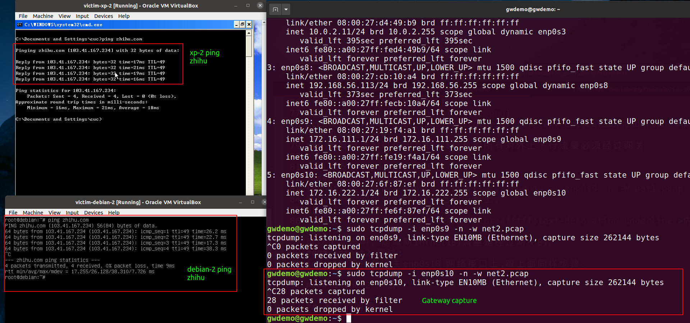

内部网络2上ping zhihu

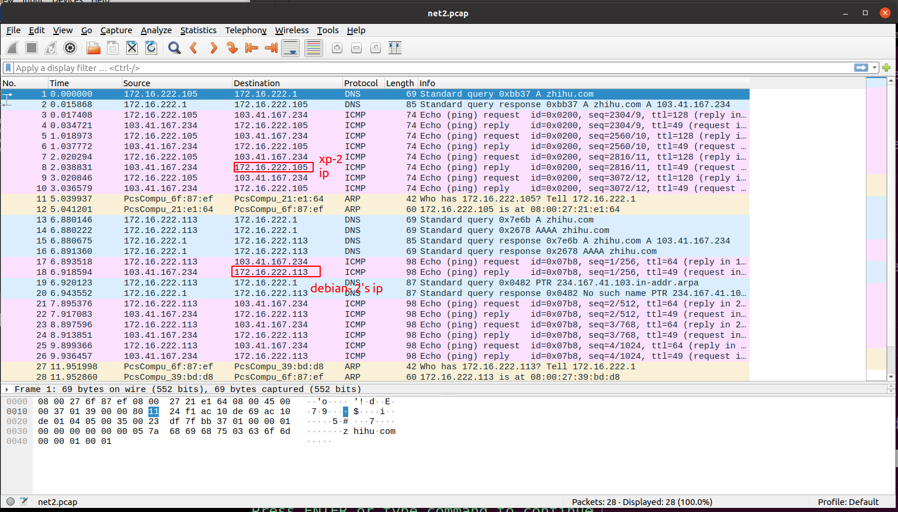

网关在内部网络2上所抓到的包

#### attacker 互联网测试：
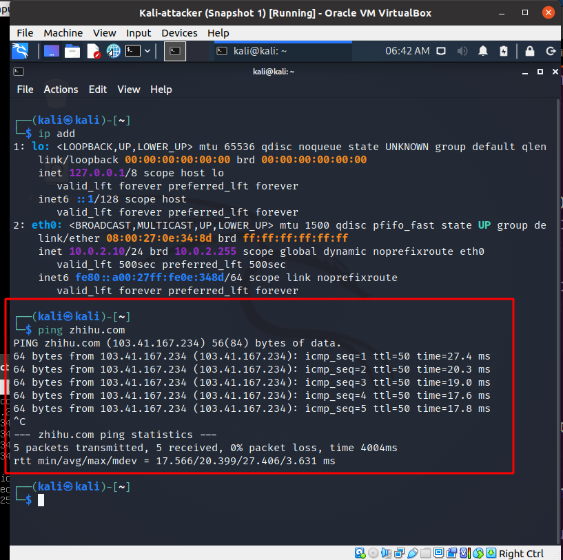

攻击者主机可以访问互联网

* 将网关关机后，靶机均不能访问互联网.可以说明，均能访问互联网,且靶机的上下行流量经过网关。

## 遇到的问题：

* 使用sodu时出现：Error message "sudo: unable to resolve host 
应该是改网关主机名之后，文件中的没有相应修改。
[参考这个🔗](https://askubuntu.com/questions/59458/error-message-sudo-unable-to-resolve-host-none)
将/etc/hosts  文件中的`127.0.0.1 localhost localhost.localdomain penguin`的penguin改为自己的主机名字即可。

## 参考链接
* [老师给的虚拟机网络资料：VirtualBox Network Settings: Complete Guide](https://www.nakivo.com/blog/virtualbox-network-setting-guide/)
* [吕师哥的作业](https://github.com/CUCCS/2020-ns-public-LyuLumos)

## 根据个人理解写的课件上的思考题：
### 以下⾏为分别破坏了CIA和AAA中哪⼀个属性或多个属性？

* 小明抄小强的作业
CIA:机密性 AAA:认证,授权
* 小明把小强的系统折腾死机了
CIA:可用性 AAA:授权 (不太确定，但审计还是可以审计的
* 小明修改了小强的淘宝订单
CIA:完整性,机密性,(淘宝订单应该属于私密信息 AAA:认证，授权
* 小明冒充小强的信用卡账单签名
CIA:完整性 AAA:认证，授权
* 小明把自⼰电脑的IP修改为小强电脑的IP，导致小强的电脑⽆法上⽹
CIA:可用性 AAA:认证，授权 

### 有⼀次，小明⼝袋里有100元，因为打瞌睡，被小偷偷⾛了，搞得晚上没饭吃。又⼀天，小明⼝袋里有200元，这次小明为了防范小偷，不打瞌睡了，但却被强盗持⼑威胁抢⾛了，搞得⼀天没饭吃，小明当天就报警了。
参考了下[课件](https://c4pr1c3.github.io/cuc-ns-ppt/chap0x01.md.html#/4/2)给的一部分答案
* 试分析两次失窃事件中的：风险、资产、威胁、弱点、攻击、影响
风险：钱被偷走,抢走
资产：口袋中的钱
威胁：小偷，强盗
弱点:打瞌睡,手无寸铁
攻击:偷、强
影响:没饭吃

* 试用P2DR模型分析以上案例中的“现⾦被抢”事件中的安全策略、安全防护、安全检测和安全响应
第一次
安全策略：睡着了，没有策略
安全防护: 放口袋里,藏起来
安全检测: 睡着了，没有检测
安全响应: 无响应
* 第二次
安全策略: 将资产藏起来,入侵检测，报警响应
安全防护: 把钱藏起来,醒着进行入侵检测
安全检测: 监视钱的完整性、机密性
安全响应: 报警

### 针对下述论点，分别设计⼀场景案例（必须和课程相关），使得该论点在该场景中成立
* 预防比检测和恢复更重要
用户密码，用户的隐私信息的机密性保护。(不断研究新的密码算法，来预防以有的密码算法被破解而造成的信息泄漏。)
* 检测比预防和恢复更重要
需要司法取证的地方
* 恢复比预防和检测更重要
对重要，有意或无意被删除数据的恢复

### 试分析“CAPTCHA图片验证码技术可以阻⽌恶意批量注册⾏为”这句话中的安全策略、安全机制和安全假设分别是什么？CAPTCHA图片举例

安全策略:注册需要授权。
安全机制:设置一定门槛的题目,作为图片验证码，求解出问题正确的人才能够被授权注册。
安全假设:求解出题目的人是被授权的人，回答错误的人不允许注册,机制实现是正确的。

### 某⼤型软件开发公司的总裁担⼼公司的专利软件设计⽅法被内部员⼯泄露给其他公司，他打算防⽌泄密事件的发⽣。于是他设计了这样⼀个安全机制： 所有员⼯必须每天向他汇报自⼰和其他竞争对⼿公司员⼯的所有联系(包括IM、电⼦邮件、电话等等) 。你认为该安全机制能达到总裁的预期安全效果吗？为什么？
我认为不能达到:
* 安全机制的部署和管理不一定能得到员工的配合,管理困难。
* 安全机制的集合不能够实现所有的安全策略,因为员工仍然可以通过其他方式泄漏(线下口述等)
* 安全机制的实现是不一定正确(每天下班汇报，第二天上班又是新的一天了)

### 请列举你经常使用的互联⽹服务有哪些，通过公开渠道检索这些服务提供商在历史上是否经历过安全事件？据此，撰写⼀篇主题为：《某某互联⽹服务安全问题概要》的调研报告。

~或许可以成为我通识课《信息安全对抗概论》的结课作业。~
