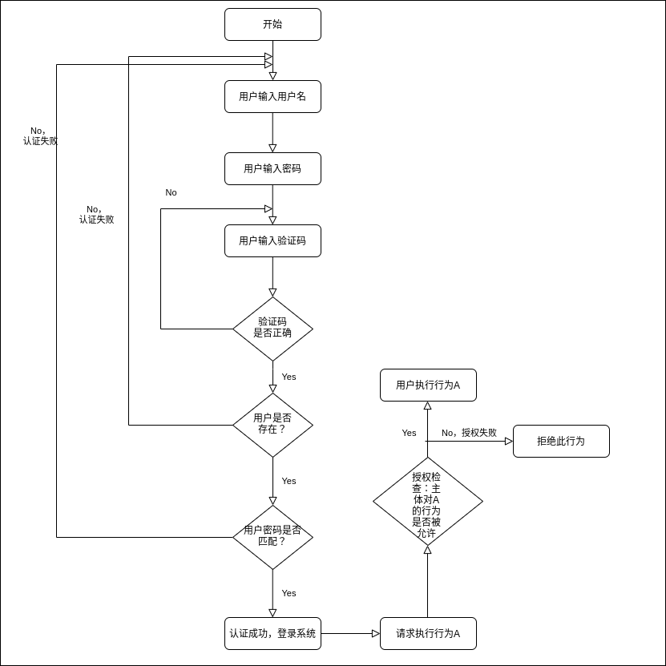
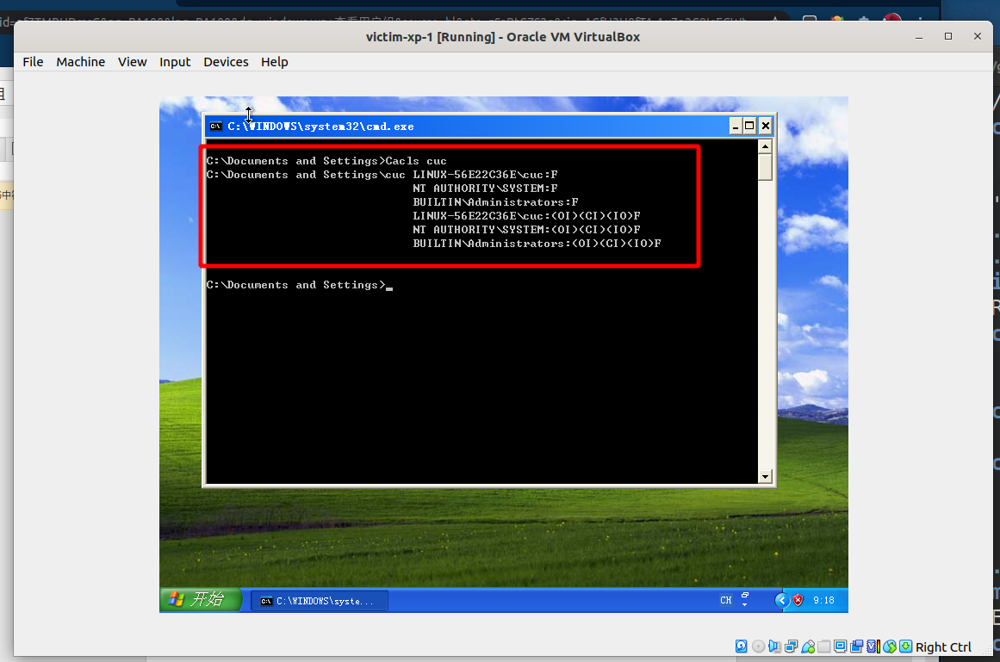
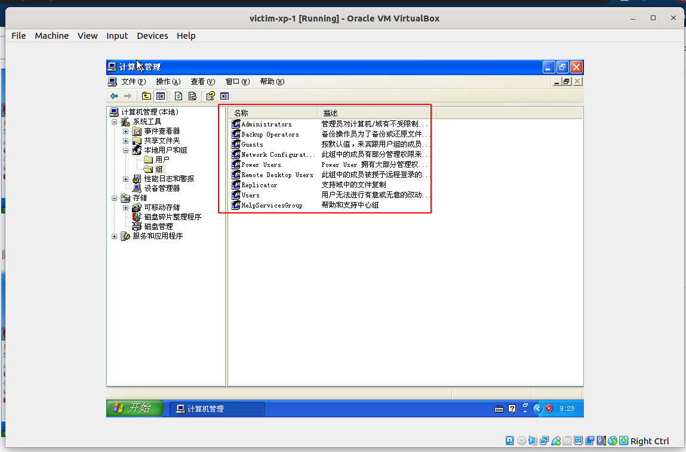
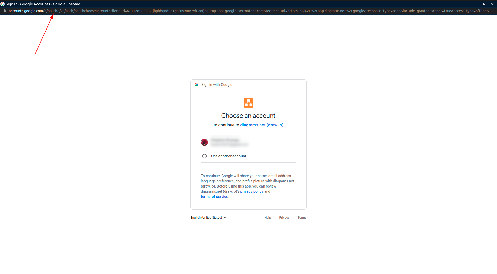
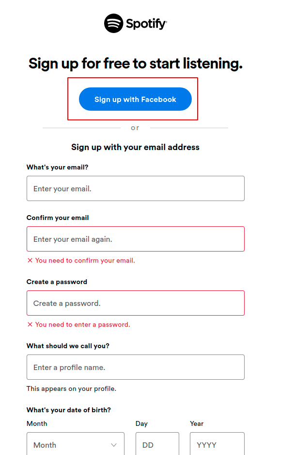
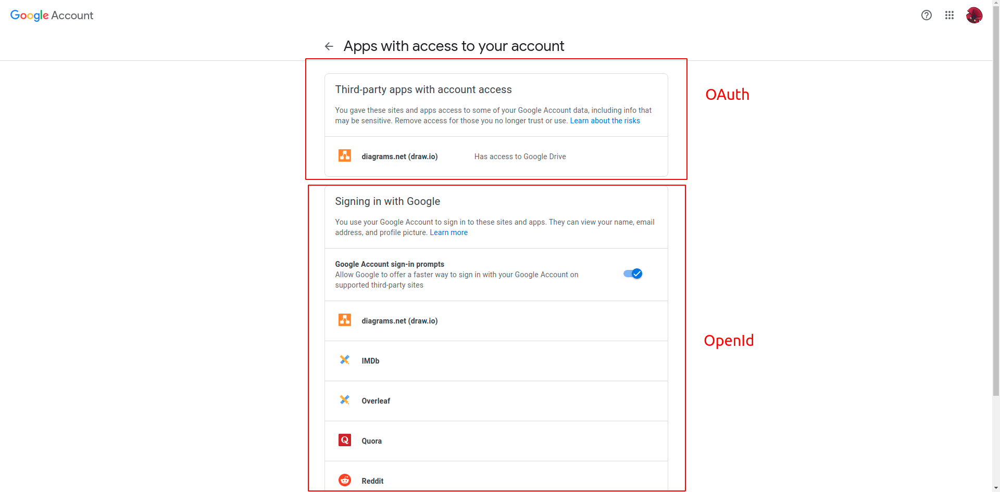
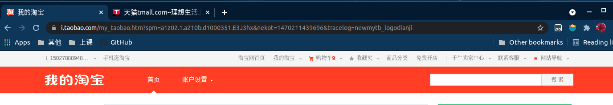

# 2.10 课后题
## 2.“找回口令功能”和“忘记密码”在访问授权机制中的意义？请尝试设计几种安全的“找回口令功能”，详细描述找回口令的用户具体操作过程。
>参考教材[2.3.4] ：（身份）认证:认证的实现过程就是将主体（数字）身份标识唯一的绑定到（真实）主体的过程。身份认证是访问授权的基础，没有身份认证就无法实现访问授权。

"找回口令功能”和“忘记密码"功能实际上就是主体需要向访问控制系统的身份认证模块证明“我就是”,被证明之后，授权其可以更改密码。

**邮箱找回口令功能设计：**
1. 让用户输入注册时填写的邮箱地址,如果用户提供了错误的邮件地址，不要提示他。
2. 如果用户输入的邮箱错误,给其注册填写的邮箱发邮件说明，有人尝试重置密码，但是他输入的邮箱不在数据库里面。
3. 在提交表单之前，为了防止机器人攻击,加上CAPTCHA 识别,来让用户填写。
4. 在所发的重置口令的邮件里面告诉用户，哪个 IP 地址在申请重置你的密码。
5. 用户使用邮件所发的验证码，进行口令重置。

## 3.绘制用户使用用户名/口令+图片验证码方式登录系统的流程图。考虑认证成功和失败两种场景，考虑授权成功和失败两种场景。

## 4.Windows XP / 7 中的访问控制策略有哪些？访问控制机制有哪些？
**自主访问控制:**
访问控制列表（Access Control List, ACL）

所有用户或用户组的权限访问设置都会被存储下来，并允许随时被有权限进行修改的用户进行调整，如取消某个用户对某个资源的“写入”权限

**查看cuc用户目录访问控制列表：**

**强制访问控制：**

“Administrators”组的全部成员都拥有“更改用户的权限”(Take Ownership)的权力。

**基于角色的访问控制:**

一个身份被分配给一个被授权的组。在访问控制列表中，每一个用户或用户组都对应一组访问控制项。

## 5.用权限三角形模型来理解并描述下 2 种威胁模型：提权、仿冒。
参考课本：
**微软的STRIDE 模型**
| 威胁     | 安全性属性 |
|----------|------------|
| 篡改     | 完整性     |
| 否认     | 不可抵赖性 |
| 信息泄露 | 机密性     |
| 拒绝服务 | 可用性     |
| 提升权限 | 授权       |

**基于角色的访问控制模型:**

* 提权：
提权从目的可分为纵向提权与横向提权：
1. 纵向提权：低权限角色获得高权限角色的权限。
2. 横向提权：获得同级别角色的权限.

* 仿冒：
A用户仿冒B用户，这样就得到了B用户的权限,B用户的权限,但没有改变B用户的权限。

## 6.试通过操作系统的访问控制机制来达到预防一种真实病毒的运行目的。
对于一个系统服务，管理员正确配置其调用的可执行文件的读写权限使得低权限用户没有对其程序的写入权限。这样就可以避免这个程序被病毒替换成任意可执行程序。
## 7.什么是 OAuth？
 让用户告诉系统，同意第三方应用访问自己的一部分数据,系统从而产生一个令牌来认证与授权的一种协议。

## 8.什么是 OpenID？
参考：
* [What is OpenID?](https://openid.net/what-is-openid/)
简单的说就是允许用户使用一个已经存在的帐号来登录多个网站，而不必创建新的密码。

**Sign Up with...**

## 9.试用本章所学理论分析 OAuth 和 OpenID 的区别与联系。

oauth2的目的用来授权，openid用来认证。openid提供对实体的鉴别，而OAuth更通用。当一个服务向第三方服务发行一个令牌可以用来访问一个被保护资源的令牌时，只要拥有令牌就能够访问其被授予的资源,而不管其身份。(所以令牌泄漏就很危险了并且两者服务不能混淆。)
一个例子：

## 10.如何使用 OAuth 和 OpenID 相关技术实现单点登录（Single Sign On）？
* 单点登录 (SSO):
比如淘宝和天猫，你登录了淘宝，天猫也会自动登录.

1. 用户访问A系统，但没有登录。
2. 跳转到一个第三方的SSO系统，SSO系统也没有登录，跳转到用户登录页面。
3. 用户如果使用第三方登录。SSO让用户跳转到第三方网站，第三方网站要求用户登录，得到用户同意后使用第三方登录。
4. 第三方网站重定向回SSO系统，同时发回一个授权码。SSO使用授权码，向第三方服务请求令牌，第三方服务返回令牌，SSO系统使用令牌，向第三方网站请求用户数据。。
5. SSO系统进行认证后，将登录状态写入SSO的session，浏览器（Browser）中写入SSO域下的Cookie。SSO系统登录完成后会生成一个ST（Service Ticket），然后跳转到A系统，同时将ST作为参数传递给A系统。
6. A系统拿到ST系统后，从后台向SSO发送请求，验证ST是否有效。
7. 验证通过后，A系统将登录状态写入session并设置A系统域下的Cookie
8. 当用户访问B系统时，B系统没有登录，跳转到SSO。
9. SSO验证用户已经为登录状态后，SSO生成ST，跳转到B系统，并将ST作为参数传递给B。
10. B拿到ST，后台访问SSO，验证ST是否有效
11. 验证成功后，B将登录状态写入session，并在B网站的域下写入Cookie。

## 参考链接：
* [找回密码的功能设计](http://www.ruanyifeng.com/blog/2019/02/password.html)
* [Windows XP权限设置详解](https://wenku.baidu.com/view/ff6c81717fd5360cba1adbcb.html)
* [windows提权看这一篇就够了](https://cloud.tencent.com/developer/article/1771226)
* [OAuth 2.0 的一个简单解释](https://www.ruanyifeng.com/blog/2019/04/oauth-grant-types.html)
* [知乎：OpenID 和 OAuth 有什么区别？](https://www.zhihu.com/question/19628327)
* [单点登录原理与简单实现](https://www.cnblogs.com/ywlaker/p/6113927.html)
* [单点登录（SSO）看这一篇就够了](https://developer.aliyun.com/article/636281)
* [揭师姐的作业](https://github.com/CUCCS/2019-NS-Public-YanhuiJessica/blob/ns0x02/ns-0x02/README.md)
