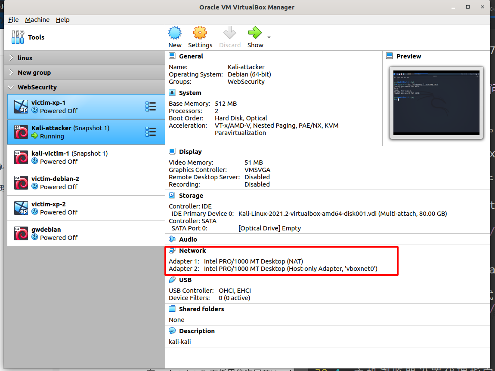
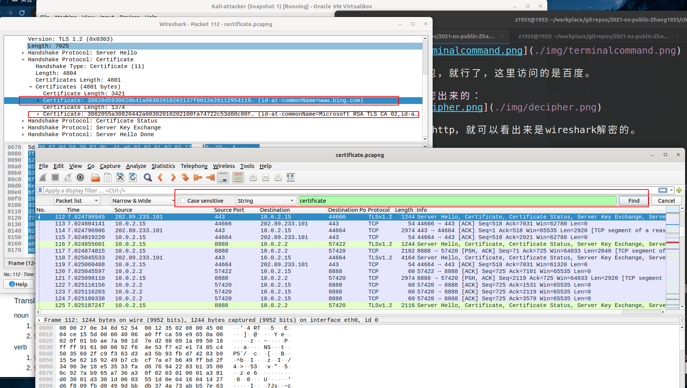

# 第三章实验
## 实验环境：
* kali 2021.2 virtualbox 6.1.26
* ubuntu 20.04
* chrome Version 93.0.4577.63

## HTTP代理服务器实验
### 使用http代理服务器访问HTTPS站点时，通信传输内容是否会被代理服务器“看到”？

#### 实验步骤:
1. 在kali中安装tinyproxy。
```bash
sudo apt install tinyproxy
```
2.  编辑tinyproxy配置文件，取消Allow 10.0.0.0/8注释
```bash
sudo vim /etc/tinyproxy/tinyproxy.conf
```

开启tinyproxy服务：
```bash
/etc/init.d/tinyproxy start
```
3. 设置kail虚拟机联网方式为NAT和端口转发，默认tinyproxy监听8888端口


* 最后网络总览：


* 测试curl通过代理访问百度：

可以访问到，接下来就是设置浏览器代理了。

4. 主机浏览器设置代理指向tinyproxy的服务地址：
* 使用SwichyOmega插件更改chrome代理:


* 系统代理是关闭的：


5. 在kali也就是代理服务器中,开启抓包。

* kali 的网络配置:
eth0 ip: 10.0.2.15 
Gateway ip: 10.0.2.2
DNS server ip:10.0.2.3

在eth0网卡上抓包就ok了。

6. 主机访问https站点,结束抓包，分析抓包结果
访问百度，访问e.cuc.edu.cn:


#### http.request.method eq GET 查看所有HTTP GET代理请求


## Q:使用http代理服务器访问HTTPS站点时，通信传输内容是否会被代理服务器“看到”？
**follow http tcp流：**

* 从客户端到代理服务器：

* 从代理服务器到web服务器：


几乎裸奔

**follow https tcp流：**
百度的
* 从本地到代理服务器：

* 从代理服务器到web服务器：

可以看到消息被加密了。

参考[HTTP tunnel - Wikipedia](https://en.wikipedia.org/wiki/HTTP_tunnel):
> The client connects to the proxy server and requests tunneling by specifying the port and the host computer to which it would like to connect.


所以虽然代理服务器不知道传输的内容，但是，代理客户端会发送Connect请求到http代理服务器。最开始的时候是会知道client访问了哪个网站的。

#### http.request.method eq CONNECT 查看所有HTTPS代理请求


### 使用wireshark解密HTTPS流量:

只能本地玩耍？

1. 在client上设置SSLKEYLOGFILE:
```bash
export SSLKEYLOGFILE=$HOME/workplace/sslkey.txt
chmod 666 sslkey.txt
```
* edit -> preferences -> TCP ：开启：Reassemble out-of-order segments (since Wireshark 3.0, disabled by default).
* edit -> preferences -> TCP: 开启：Allow subdissector to reassemble TCP streams. Enabled by default.
* Preferences -> Protocols -> TLS, and change the (Pre)-Master-Secret log filename


在终端中打开,wireshark, google-chrome：


然后开始抓包，就行了，这里访问的是百度。

### 然后解密出来的：


出现了443的http，可以看出来是wireshark解密的。
follow一下：


### 使用wireshark提取pcap包中的SSL证书:
按照[课本](https://c4pr1c3.github.io/cuc-ns/chap0x03/exp.html)上的实验步骤：

之前那个证书应该抓漏了,这里代理服务器开始重新抓包:
* client访问bing

* scp传到本地后，抓到的带有证书的包：


* 导出分组字节流 ,然后按照课本上的弄就ok了：
```bash
openssl x509 -in out.der -inform der -text -noout > certout
```


## 遇到的问题：

* 开启tinyproxy后,在kali，也就是代理服务器上抓的tcp包，配置端口转发,clinet用浏览器访问网页时,为什么会有tcp包的目的IP地址为网关的IP地址？不应该只有目的web服务器的地址？


* follow了下tcp流：

发现路由器和代理服务器与代理服务器和百度的传输的数据一模一样。
*  服务器和网关的tcp通信过程：


在网上没有搜到相关内容,但思考了一下，,认为这里的逻辑是：

&ensp;&ensp;&ensp;配置的端口转发,当在client发tcp包时，发给127.0.0.1:8080,然后通过端口转发发给virtualbox NAT router。在10.0.2.15的8888端口处接受到发来的tcp包,但这个tcp包的源ip地址是网关的地址，代理服务器就认为是网关发来的代理请求。然后就将收到包发回给网关。网关再发给主机的127.0.0.1:8080。所以就有和网关的tcp包。

## 参考资料：
* [HTTP tunnel - Wikipedia](https://en.wikipedia.org/wiki/HTTP_tunnel)
* [TLS - The Wireshark Wiki](https://wiki.wireshark.org/TLS?action=show&redirect=SSL)
* [What happens in a TLS handshake?](https://www.cloudflare.com/learning/ssl/what-happens-in-a-tls-handshake/)
* [Wireshark Tutorial: Decrypting HTTPS Traffic](https://unit42.paloaltonetworks.com/wireshark-tutorial-decrypting-https-traffic/)

## 课后习题
1. 代理技术在网络攻防中的意义？
(1) 对攻方的意义？ 

&ensp;&ensp;可以隐藏自己，绕过网络安全审查/检测机制。对防守方的网络安全检测、审计机制造成威胁。

(2) 对守方的意义？

&ensp;&ensp;通过网络代理可以加密通信数据，防止通信数据被窃听和篡改。通过审查网络通信数据，进行恶意流量检测和过滤并可发现、阻止失泄密行为。改变网络拓扑结构，实现跨局域网/异构网络通信或者用于安全保护等级较高的内部网络。

2. 常规代理技术和高级代理技术的设计思想区别与联系？
联系：都是通过第三方服务来获得资源。
区别：高级代理技术对通信的匿名性有较高要求。
