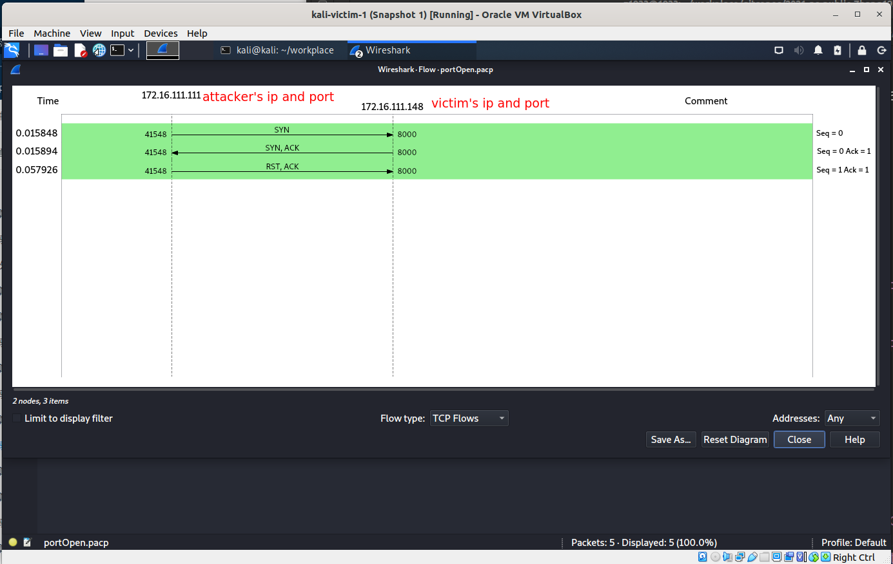
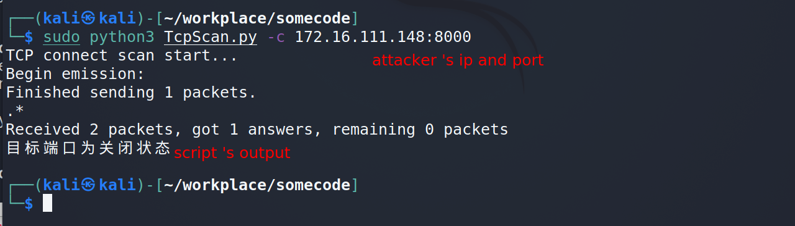

* [实验环境](#实验环境)
* [网络拓扑](#网络拓扑)
* [端口状态模拟](#端口状态模拟)
* [脚本使用](#脚本使用)
* [TCP connect scan](#tcp-connect-scan)
  * [API函数](#api函数)
  * [端口开放](#端口开放)
  * [端口不可达](#端口不可达)
  * [目标端口为过滤状态](#目标端口为过滤状态)
* [TCP stealthy scan](#tcp-stealthy-scan)
  * [脚本函数](#脚本函数)
  * [端口开放状态](#端口开放状态)
  * [端口不可达状态](#端口不可达状态)
  * [端口过滤状态](#端口过滤状态)
* [TCP Xmas scan](#tcp-xmas-scan)
  * [脚本函数](#脚本函数)
  * [端口开放状态](#端口开放状态)
  * [端口不可达状态](#端口不可达状态)
  * [端口过滤状态](#端口过滤状态)
* [TCP fin scan](#tcp-fin-scan)
  * [脚本函数](#脚本函数)
  * [端口开放状态](#端口开放状态)
  * [端口不可达状态](#端口不可达状态)
  * [端口过滤状态](#端口过滤状态)
* [TCP null scan](#tcp-null-scan)
  * [脚本函数](#脚本函数)
  * [端口开放状态](#端口开放状态)
  * [端口不可达状态](#端口不可达状态)
  * [端口过滤状态](#端口过滤状态)
* [UDP scan](#udp-scan)
  * [脚本函数](#脚本函数)
  * [端口开放状态](#端口开放状态)
  * [端口关闭状态](#端口关闭状态)
  * [端口过滤状态](#端口过滤状态)
* [课后题](#课后题)
  * [通过本章网络扫描基本原理的学习，试推测应用程序版本信息的扫描原理，和网络漏洞的扫描原理。](#通过本章网络扫描基本原理的学习，试推测应用程序版本信息的扫描原理，和网络漏洞的扫描原理。)
  * [网络扫描知识库的构建方法有哪些？](#网络扫描知识库的构建方法有哪些？)
* [参考资料](#参考资料)

# 基于 Scapy 编写端口扫描器
## 实验环境
* VirtualBox 6.1.26
* 攻击者主机： kali 2021.2 (内部网络1)
* 网关：Debian 10 (内部网络1)
* 靶机: kali 2021.2 （内部网络1）

## 网络拓扑

## 端口状态模拟
* TCP开放：python http.server,开放在8000端口
* TCP端口关闭：关闭python http.server服务
* TCP端口过滤:开启ufw,用ufw编写过滤规则
* UDP: dnsmask
## 脚本使用
```bash
python3 TcpScan.py -h 
```

## TCP connect scan
* 原理参考,课本以及nmap上的一张图：
[TCP Connect Scan (-sT) | Nmap Network Scanning](https://nmap.org/book/scan-methods-connect-scan.html)


* 之前遇到三次握手一直失败,抓包发现系统自动发送rst包,让系统不主动发送rst包，用iptable,防火墙墙掉。参考[Unwanted RST TCP packet with Scapy](https://stackoverflow.com/questions/9058052/unwanted-rst-tcp-packet-with-scapy/20645079).
```bash
sudo iptables -A OUTPUT -p tcp --tcp-flags RST RST -s <src_ip> -j DROP
```

### API函数
```python
def TCPConnect(ip,port):
    """
        目标端口是开放的：返回1.
        目标端口关闭，返回0
        目标端口没有任何响应，返回-1
    """
    print("TCP connect scan start...")
    pkt=IP(dst=ip)/TCP(sport=sport,dport=port,flags="S")
    ans=sr1(pkt,retry=2,timeout=0.2)
    if not ans:
        return -1
    F=ans['TCP'].flags
    if F & ACK and F & SYN :
        pkt=IP(dst=ip)/TCP(sport=sport,dport=port,seq=ans.ack,ack=ans.seq+1,flags="AR")
        send(pkt)
        return 1
    elif F & RST and F & ACK:
        return 0
    else:
        return -1
```

### 端口开放


* 攻击者脚本输出结果：


* tcp流可视化：


靶机端口开放状态,返回了syn,ack包。

和课本中理论一样。

### 端口不可达
* 关闭python http.server,8000端口关闭


* 攻击者脚本输出结果:


* TCP流：


跟课本上所说的一致。
### 目标端口为过滤状态
* 开一个python http.server,8000 端口开放,ufw 开启过滤规则：


* 攻击者脚本输出结果：


* TCP 流

发送的3个syn包没有一个回复的。与理论相符。


## TCP stealthy scan 

原理参考课本上以及[nmap上扫描这部分的图](https://nmap.org/book/synscan.html)：


### 脚本函数
```python
def TcpStealthy(ip,port):
    """
        目标端口是开放的：返回1.
        目标端口关闭，返回0
        目标端口没有任何响应，返回-1
    """
    print("####TCP stealth scan start...###")
    pkt=IP(dst=ip)/TCP(sport=sport,dport=port,flags="S") # 不成功尝试2次
    ans=sr1(pkt,retry=2,timeout=0.2)    
    if not ans :
        return -1
    F=ans['TCP'].flags
    if F & ACK and F & SYN:
        send(IP(dst=ip)/TCP(sport=sport,dport=port,seq=ans.ack,ack=ans.seq+1,flags="R"))
        return 1
    elif F & ACK and F & RST:
        return 0

```
### 端口开放状态


* 攻击者脚本输出结果：


* TCP流：

### 端口不可达状态
关闭8000端口上的http.server

* 攻击者脚本输出结果：


* TCP流：


和课本中理论一样。
### 端口过滤状态
开启过滤规则，开启http.server


* 攻击者脚本输出结果：


* TCP流：


## TCP Xmas scan 
扫描
### 脚本函数
```python
def TCPXmas(ip,port):
    """
        目标端口是关闭：返回1.
        目标端口开放或者过滤状态，返回0
        其他情况返回-2
    """
    print("TCP Xmas scan start...")
    pkt=IP(dst=ip)/TCP(sport=sport,dport=port,flags="FPU")
    ans=sr1(pkt,retry=2,timeout=0.2)
    if not ans :
        return 0
    F=ans['TCP'].flags
    if F & RST :
        return 1
    return -2

```
### 端口开放状态


* 攻击者脚本输出结果：


* TCP流：


### 端口不可达状态
关闭http.server


* 攻击者脚本输出结果：


* TCP流：


### 端口过滤状态


* 攻击者脚本输出结果：


* TCP流：


没啥毛病。

## TCP fin scan 

### 脚本函数
```python
def TCPFin(ip,port):
    """
       端口关闭状态，返回1
       端口开放或者过滤状态，返回0
       其他情况，返回-2
    """
    print("TCP fin scan start...")
    pkt=IP(dst=ip)/TCP(sport=sport,dport=port,flags="F")
    ans=sr1(pkt,retry=2,timeout=0.2)
    if not ans:
        return 0
    F=ans['TCP'].flags
    if F & RST:
        return 1
    return -2 

```
### 端口开放状态


* 攻击者脚本输出结果：


* TCP流：


### 端口不可达状态


* 攻击者脚本输出结果：


* TCP流：


### 端口过滤状态


* 攻击者脚本输出结果：


* TCP流：


跟理论相符
## TCP null scan

### 脚本函数
```python
def TCPNull(ip,port):
    """
       端口关闭状态，返回1
       端口开放或者过滤状态，返回0
       其他情况，返回-2
    """
    print("TCP null scan start...")
    pkt=IP(dst=ip)/TCP(sport=sport,dport=port,flags="")
    ans=sr1(pkt,retry=2,timeout=0.2)
    if not ans:
        return 0
    F=ans['TCP'].flags
    if F & RST:
        return 1
    return -2 

```
### 端口开放状态


* 攻击者脚本输出结果：


* TCP流：

发现可视化的TCP流wireshark打开查看图表直接报错：


应该跟flag设置成空值有关

* wireshark 抓包结果： 


### 端口不可达状态


* 攻击者脚本输出结果：


* wireshark抓包结果：


### 端口过滤状态


* 攻击者脚本输出结果：


* 抓包结果：


没毛病

## UDP scan

[参考nmap这部分的内容](https://nmap.org/book/scan-methods-udp-scan.html)
* 返回一个UDP包，说明端口为开放状态(unusual)
* ICMP type 3,code 3 说明端口为关闭状态 
* ICMP type 3,code 1, 2, 9, 10, or 13 端口为过滤状态
* 没有回应，过滤或者开放

**返回的open|filtered状态仍然含糊不清，但nmap的workaroud：**
nmap还会根据特殊协议构造数据包，而不是简单构造空payload:

> open ports rarely respond to empty probes. Those ports for which Nmap has a protocol-specific payload are more likely to get a response and be marked open
>To send the proper packet for every popular UDP service, Nmap would need a large database defining their probe formats. Fortunately, Nmap has that in the form of nmap-service-probes, which is part of the service and version detection subsystem described in Chapter 7, Service and Application Version Detection.
也就是有一个数据库,提供verson scan,在open|filtered之前缩小范围
>If any of the probes elicit a response from an open|filtered port, the state is changed to open.


这里udp通过网关的53端口的dnsmask服务程序模拟端口。
### 脚本函数
```python
def UDPScan(ip,port):
    """
        端口关闭，返回1
        端口开放状态:返回0
        端口过滤状态：返回-1
        端口过滤或者开放状态，返回-2
    """
    print("UDP scan start ...")
    pkt=IP(dst=ip)/UDP(sport=sport,dport=port)
    ans=sr1(pkt,retry=2,timeout=0.2)
    if not ans:
        return -2
    if ans.haslayer(UDP):
        return 0
    if ans.haslayer(ICMP):
        if int(ans.getlayer(ICMP).type)==3 and  int(ans.getlayer(ICMP).code)==3:
            return 1
        if int(ans.getlayer(ICMP).type)==3 and  int(ans.getlayer(ICMP).code) in [1,2,9,10,13]:
            return  -1
    return -3
```
### 端口开放状态


* 攻击者脚本输出结果：


* 传输流：


### 端口关闭状态

随便选一个网关上关闭的端口


* 攻击者脚本输出结果：


* 传输流：


### 端口过滤状态


* 攻击者脚本输出结果：


* 传输流：


面对防火墙,nmap的建议是：

> If you can bypass that problem by launching the scan from behind the firewall rather than across it, do so.
## 课后题

### 通过本章网络扫描基本原理的学习，试推测应用程序版本信息的扫描原理，和网络漏洞的扫描原理。

&ensp;&ensp;简单的说：就是模拟不同的环境,在该环境上给定不同的输入,然后总结出不同情况的输出来构建知识库。扫描时，根据构造的输入、得到的输出查知识库表推断。
&ensp;&ensp;虽然协议大的方向是定的，但协议仍然有细枝末节的地方没有定义，不同的人实现协议会有不同的处理方式，或者干脆不处理。
&ensp;&ensp;如果知道了应用程序版本信息，发现其是开源程序，那么就直接进行源代码级别的分析。
### 网络扫描知识库的构建方法有哪些？

&ensp;&ensp;在一个测试环境上模拟出一个环境，然后,黑盒测试。
&ensp;&ensp;分析一些开源的网站架构。

## 参考资料
* [Get TCP Flags with Scapy - Stack Overflow](https://stackoverflow.com/questions/20429674/get-tcp-flags-with-scapy)
* [Unwanted RST TCP packet with Scapy - Stack Overflow](https://stackoverflow.com/questions/9058052/unwanted-rst-tcp-packet-with-scapy/20645079)
* [TCP Connect Scan (-sT) | Nmap Network Scanning](https://nmap.org/book/scan-methods-connect-scan.html)
* [TCP SYN (Stealth) Scan (-sS) | Nmap Network Scanning](https://nmap.org/book/synscan.html)
* [UDP Scan (-sU) | Nmap Network Scanning](https://nmap.org/book/scan-methods-udp-scan.html)
* [scapy 文档](https://scapy.readthedocs.io/en/latest/usage.html)
* [2020-ns-public-LyuLumosP](https://github.com/CUCCS/2020-ns-public-LyuLumos/tree/ch0x05/ch0x05#udp-scan)
* [2019-NS-Public-YanhuiJessica](https://github.com/CUCCS/2020-ns-public-LyuLumos/tree/ch0x05/ch0x05#udp-scan)
